# CritterFarm: Calorie Critters

A native Android game that gamifies weight loss using **only** on-device Android Health
Connect data, to nurture a Tamagotchi-style virtual pet farm. No backend, no accounts, no
network calls — everything lives on the device.

## The game loop

Sprout the Blob (and later, other critters) grows through six health-driven zones:

| Zone | Health Connect source | What it does |
|---|---|---|
| **Growth Spark** | `TotalCaloriesBurnedRecord` / `ActiveCaloriesBurnedRecord` vs. `NutritionRecord` | A *safe* calorie deficit mints Mana Sparks that level up your critter. Deficits are clamped to a medically sane band (~1,000 kcal/day) — crash-dieting never earns extra loot, and a very low logged intake gets a supportive message instead of a reward. |
| **Pasture Roam** | `StepsRecord` / `DistanceRecord` | Steps convert into coins (100 steps = 1 coin) and drive the step-ring stat pod. |
| **Fresh Pond** | `HydrationRecord` | Hydration fills the pond and boosts the critter's mood. |
| **Gym Barn** | `ExerciseSessionRecord` | Logged workouts award rare Treat Tokens (5 per workout) and reduce hunger. |
| **Cozy Barn** | `SleepSessionRecord` | Last night's sleep duration is tracked toward the farm's stamina. |
| **Evolution Scale** | `WeightRecord` | The latest weigh-in is surfaced as an evolution checkpoint. |

**Daily Turn loop:** on every app open, the farm automatically syncs today's totals from
Health Connect (`HealthConnectManager.computeDelta` exercises the 48h catch-up window since
the last sync; the authoritative per-day numbers come from `getTodaySnapshot()`, since a
whole-day total is replace-safe to write repeatedly while a partial delta is not). Rewards
aren't paid out on sync, though — tapping the **Claim Daily Turn** chest is what actually
tallies the day's stats and deposits coins/XP/treats/Mana Sparks, with an arcade-style
count-up animation. Claiming is idempotent: opening the chest twice in one day only pays out
once.

**Dormant Zones:** every zone works independently of the others. If only some Health Connect
permissions are granted (or Health Connect isn't installed at all), the ungranted zones show
up as sleepy "Dormant Zones" with warm, specific copy — never an error screen. The app is
fully playable with zero permissions granted.

## Stats at a glance

Every zone's number sits in one **"Today on the farm"** card, in a fixed order, and every row
answers the same three questions:

```
🐾 Pasture Roam                        3,588 steps to go
6,412  / 10,000 steps
▓▓▓▓▓▓▓▓▓▓▓▓▓░░░░░░░░░░░░░░░░░░░░░░░░░░
```

- **Big current value**, then `/ target`, then a status string (`3,588 steps to go`,
  `Goal met!`, `Link health to track`).
- A **dormant zone still shows its target** — an unlinked farm tells you where you need to be
  instead of hiding the number.
- Units are the ones you actually read: **steps**, **kcal**, **fl oz**, **sessions**, **h m**
  (sleep), **lb** (weight). Health Connect's ml/kg values are converted in one place
  (`StatsFormat.kt`) so they can be unit-tested.
- Bar colour carries the state as well as the text: gold/green at goal, the zone's accent while
  in progress, grey when unlinked. No colour-only signals.

## Screenshots

Captured from the `critterfarm_api35` emulator (Android 15) running **v1.6**. The local database
was seeded with demo days so the heatmap, shop, barn, quests, badges and decorations have something to show — the emulator has
no Health Connect data, so these are not real user stats:

| Sprout wearing a bought hat | The Barn Shop | Claim + streak payout | History heatmap |
|---|---|---|---|
| 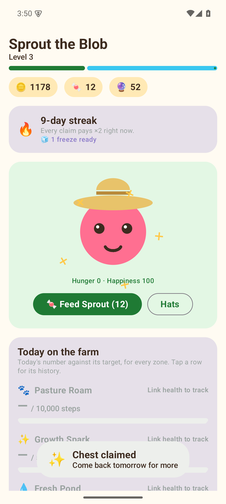 | 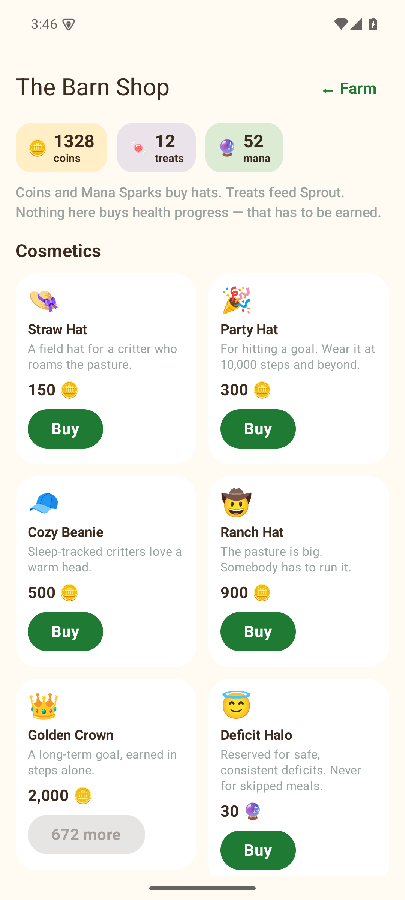 | 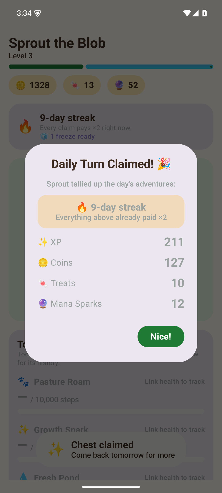 | 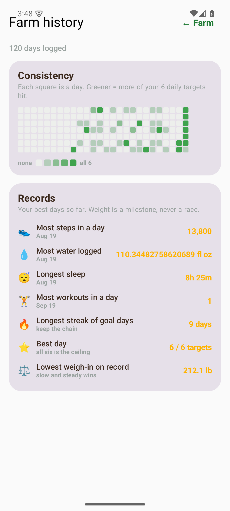 |

**v1.3 — the collection loop:**

| The Barn (two species) | Evolution requirements met | The evolution | Evolved on the farm |
|---|---|---|---|
| 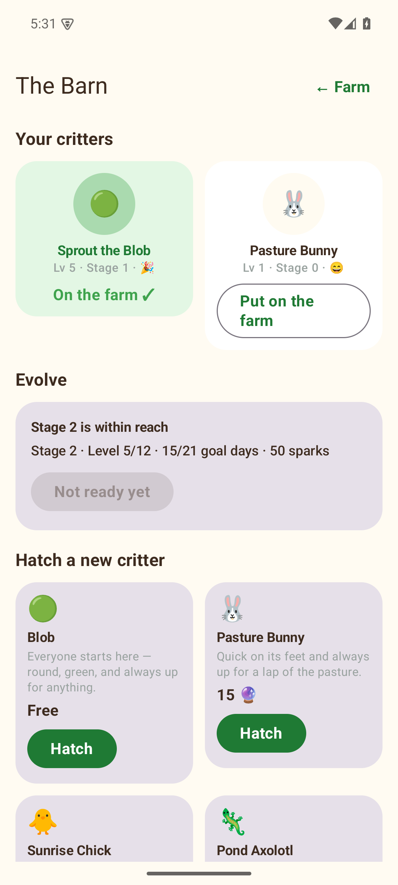 | 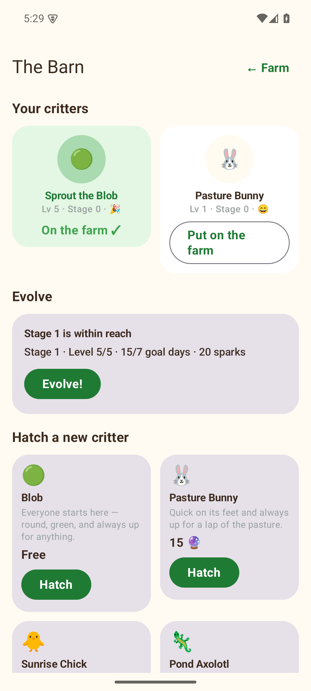 | 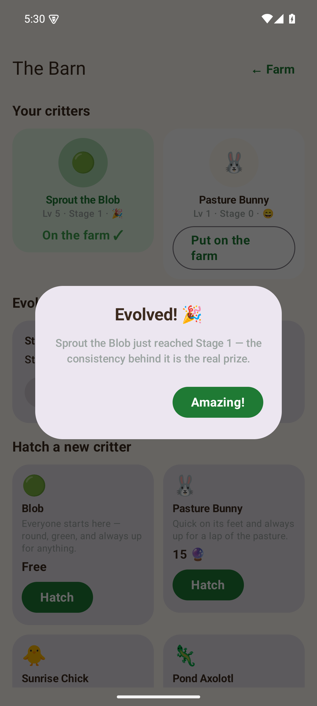 | 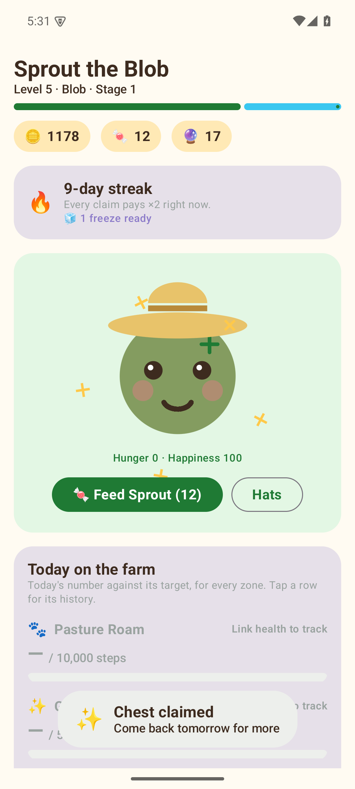 |

**v1.4 — quests, streaks and badges:**

| Today's quests | Badges (16 / 19) | Per-zone streak chips |
|---|---|---|
| 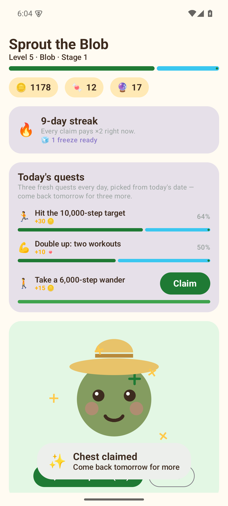 | 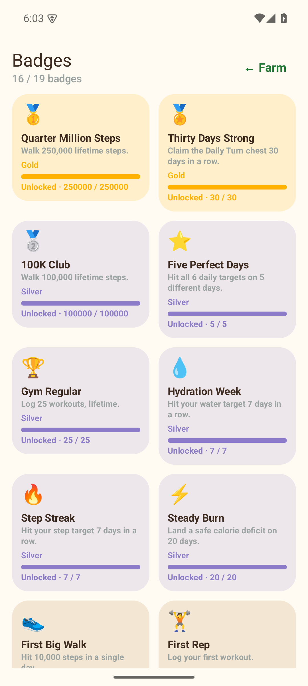 | 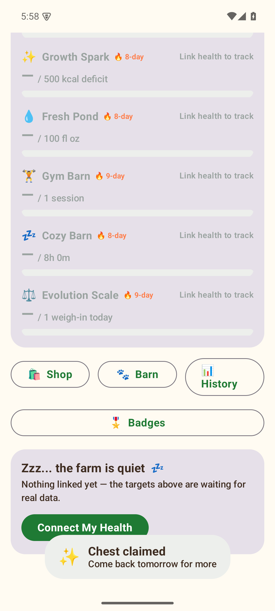 |

**v1.5 — decorate the farm, review the week:**

| Decorating the farm | The 6x4 placement grid | Your week on the farm |
|---|---|---|
| 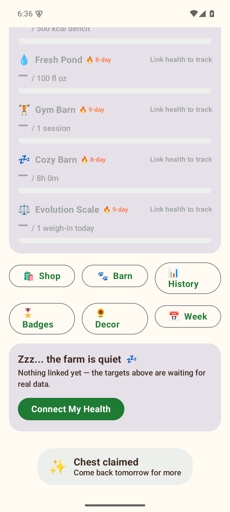 | 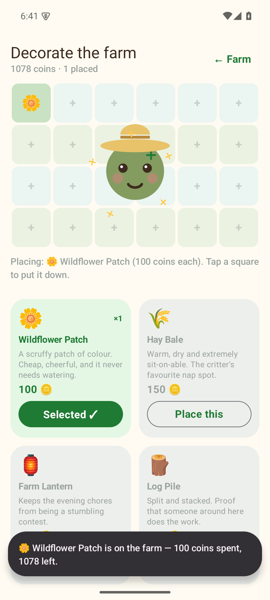 | 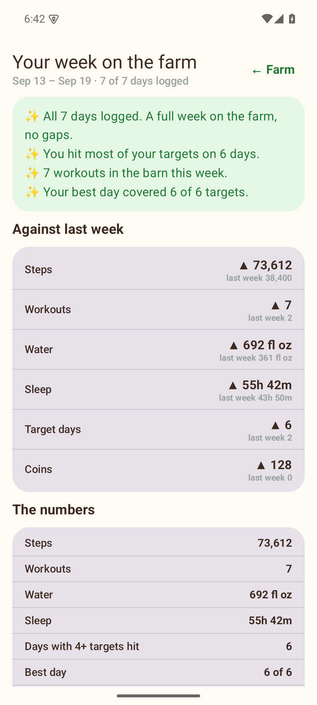 |

**v1.6 — challenges, seasonal events and streak repair:**

| Challenges + the live event | The streak-repair card |
|---|---|
| 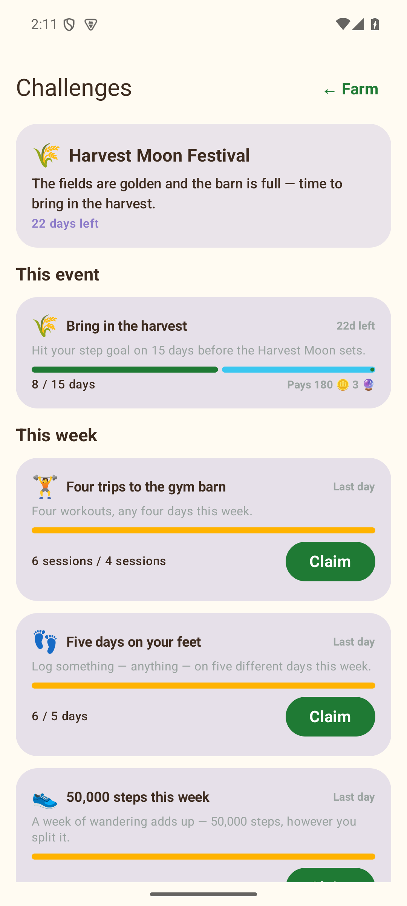 | 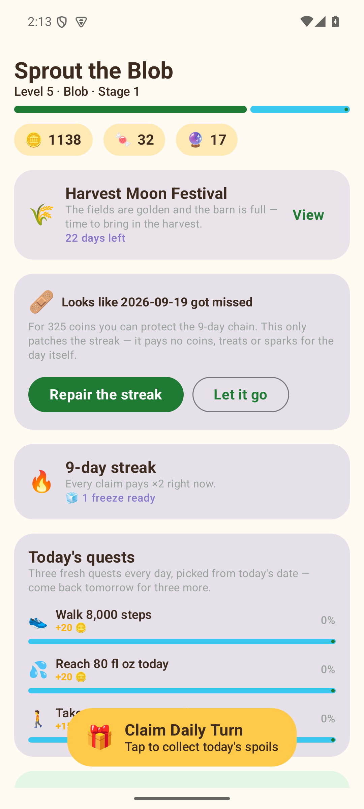 |

Earlier layout shots (v1.0 onboarding/navigation) are `01`–`03` in the same folder.

## What the currencies are for

v1.1 earned coins, treats and Mana Sparks with nothing to spend them on. v1.2 closes that loop —
each currency now has exactly one job:

| Currency | Earned from | Spent on |
|---|---|---|
| 🪙 **Coins** (100 steps = 1) | steps | hats (150–2,000) and **Streak Freezes** (250) |
| 🍬 **Treats** (5 per workout) | workouts | **feeding Sprout** — hunger ↓, happiness ↑ |
| 🔮 **Mana Sparks** (scarce) | a safe calorie deficit | the prestige **Deficit Halo** |

Every hat is drawn with the same Canvas as the critter, so Sprout actually wears what you buy.

**Three rules keep it honest**, and there is a unit test for the third:
1. Consistency gates capability; currency only buys decoration. You cannot purchase a level or
   an evolution.
2. Nothing buys a health shortcut — no "skip today's workout", no buying a deficit.
3. `GameEconomyTest` fails the build if anyone adds a purchasable item that is not a cosmetic or
   streak insurance.

**The streak is what compounds:** day 3 pays ×1.5, day 7 ×2, day 30 ×3 on every reward, shown
in the celebration modal. Miss a day and a Streak Freeze (if you own one) keeps the chain alive.

## History

Tap any stat row for that metric's history — a 14-day bar chart, best-ever with its date, the
average and how many days are recorded. The **Farm history** screen adds a GitHub-style
consistency heatmap (five shades for how many of the six daily targets you hit) and records:
most steps in a day, most water, longest sleep, most workouts, longest goal streak, best 6/6
day, and lowest weigh-in — framed as a milestone (*"slow and steady wins"*), never a race.

All of it is computed from the daily logs the app already stored, so it needs **no new Health
Connect permissions** and works offline.


## The Barn — collecting, hatching and evolving

Mana Sparks were a prestige curiosity in v1.2. v1.3 gives them the job that keeps a game like
this interesting: **a barn of critters you collect, and three-stage evolutions you can see.**

**Six species**, each with its own silhouette drawn with the same Canvas as everything else:

| Species | Hatch cost | Unlocked by |
|---|---|---|
| Blob | free | the starter |
| Pasture Bunny | 15 🔮 | any workout logged |
| Sunrise Chick | 25 🔮 | 3 days hitting the steps target |
| Pond Axolotl | 40 🔮 | 5 days hitting the hydration target |
| Ember Drake | 60 🔮 | 10 days hitting the deficit target |
| Cozy Sloth | 80 🔮 | 7 days hitting the sleep target |

Unlocks are computed from the stored daily logs, so **you cannot buy a species you have not
earned** — a locked card shows exactly what unlocks it, and the test suite proves a locked species
stays unhatchable even with unlimited Sparks.

**Evolution needs all three conditions at once**, and the progress is on screen at all times:

| Stage | Level | Consistency | Sparks |
|---|---|---|---|
| Stage 1 | ≥ 5 | 7 days meeting 4+ of the 6 targets | 20 |
| Stage 2 | ≥ 12 | 21 days meeting 4+ of the 6 targets | 50 |

A player always sees the next requirement (`Stage 2 · Level 5/12 · 15/21 goal days · 50 sparks`),
because an evolution you cannot see coming is not a goal — it is a lottery. Every species changes
shape at each stage, and stage 1 adds a visible sparkle, so the payoff is something you look at.

The barn is additive over v1.2: `MIGRATION_2_3` adds the new columns and marks your existing
critter as the active one, so upgrading never loses a pet. The v1.2 → v1.3 upgrade was verified on
a real seeded database (120 days of logs, coins, streak and equipped hat all preserved).

## Quests, streaks and badges

Three time horizons of motivation, all computed from the daily logs the app already stores:

**Today — daily quests.** Three quests, chosen deterministically from the date (the same day always
gives the same three, and consecutive days differ — there is a test for both). The pool covers all
six metrics: step targets from 6k to 15k, water from 64 to 100 fl oz, one to three workouts, 7h and
8h of sleep, a safe-deficit day, a *"keep it sane"* `AT_MOST` cap, and logging a weigh-in. Progress
comes straight from today's log (`64%` on the 10,000-step quest is literally `steps / 10,000`), and
claiming is idempotent per day exactly like the Daily Turn chest.

**This week — per-zone streaks.** Each of the six zones tracks its own current and best streak, shown
as a `🔥 8-day` chip on the stat row once it reaches 2. A streak that ended yesterday is still
*current* — it has just not been extended yet. Per-metric independence is tested: a water streak does
not care about your steps.

**Forever — badges.** 19 badges across Bronze, Silver and Gold, every one with a concrete threshold
computed from history: first 10k-step day, 5 perfect days, 100k and 250k lifetime steps, 10 and 25
workouts, 7-day hydration and step streaks, 30-day claim streak, 50 days logged, 20 perfect days,
and a "Consistency" family that climbs from 15 to 60 good days. Badges are never stored — they are
derived, so a badge you earned last month cannot be lost — and every locked badge shows its progress
bar, because the next one should always feel close.

Still honest: quests pay coins and treats, never health. Nothing here can be bought, and no quest
asks you to eat less.

## Decorating the farm

Eleven decorations from **100 coins to 1,500**, laid out on a fixed **6 x 4 grid** with the critter
standing in the middle. **Placing is buying** — there is no separate inventory to reconcile, so you
can never own something you cannot see, and the price is charged per copy. Tapping a square that is
already taken clears it (no refund; the screen says so).

A square physically cannot hold two things: the cell index is the table's primary key, so
"occupied" is a database constraint rather than a rule the UI has to be trusted to remember.

Decorations are **cosmetic and always will be** — a pretty farm is not progress, and nothing here
changes what the game rewards. Eleven items at 100 steps per coin means the farmhouse is a quarter
of a million steps of wandering, made visible.

## The weekly recap

Sunday-to-Saturday, with the week before it for context: totals, six week-over-week comparisons with
direction arrows, and two to four highlights. It is deliberately written so that a **thin week still
reads kindly** — there is a unit test asserting the copy never contains "fail", "bad", "lazy" or
"should", and another asserting it never mentions losing weight. The share button sends a short
plain-text summary (no images, no permissions, no weight).

## Juice

Haptics on the big moments (chest claim, feeding, purchases, evolutions, hatching) and a ~20-particle
Canvas confetti burst for claims and evolutions. The burst draws nothing at all when idle, allocates
nothing inside the draw loop, and never blocks the dialog it celebrates.

## Challenges, events and second chances

The app covered **today** (quests, the chest) and **all time** (badges, history). v1.6 adds the
missing middle: **a goal with a deadline you can watch run down.**

**Challenges are one engine; a window is just a parameter.** Weekly, monthly and seasonal-event goals
run through the same maths with a different date range, so there is a single pure function to test
rather than three. A claim is keyed by `(periodKey, challengeId)` — an ISO week, a `yyyy-MM` month, or
an event id — so the same challenge pays again next week and can never pay twice in one period.

Ten challenges: five weekly (workout count, active days, a steps total, water-goal days, sleep-goal
days) and five monthly (bigger totals, weigh-in days, safe-deficit days). Rewards scale with
difficulty; the deficit challenge scores only against the **existing** target, never a bigger one, so
no challenge ever pushes anyone to undereat.

**Seasonal events** run for a few weeks each and make decorations scarce: three items are exclusive to
the Harvest Moon Festival and **do not exist in the catalogue outside its window**. The window is
enforced inside `PlacementRules`, not just hidden in the UI, so an out-of-season item cannot be
placed even if its id is passed directly.

**Streak repair** is the one mercy rule, priced honestly at `100 + 25 x streakDays` (capped at 1,000):
- only for **exactly one missed day** — a missed week is not one bad day
- only once per gap, and only if the chain was actually alive
- it restores the **chain**, never the **work**: it pays no coins, treats, sparks or XP for the missed
  day, and a test plus an on-device check both confirm the stored rewards do not move
- declining is a normal button, not a failure — *"Let it go"* is right there and never guilted

## Architecture

Clean Architecture-ish, MVI on the UI layer:

```
health/    HealthConnectManager — the only code that talks to Health Connect.
           Every SDK call is wrapped in try/catch; a permission revoke or provider hiccup
           degrades a single field to null (never crashes), and null is kept distinguishable
           from a real zero.

data/      GameRepository — the single source of truth for game state, backed by Room.
data/local/  Room entities (CritterEntity, FarmInventoryEntity, DailySummaryLogEntity),
             DAOs (Flow-based), and CritterFarmDatabase.
data/GameRules.kt   Pure, Android-free reward math (XP curve, currency conversion, the
                     deficit guardrail, mood derivation) — unit tested in isolation.

ui/theme/    Material 3 theme: vibrant palette, rounded shapes, bold playful type.
ui/model/    GameZone — maps each zone to its required Health Connect permission(s) and
             its Dormant Zone copy, shared by onboarding and the farm screen.
ui/onboarding/  OnboardingScreen — introduces Sprout, requests permissions via
                PermissionController.createRequestPermissionResultContract(), and always
                has a path forward (granted / partial / denied / Health Connect missing).
ui/farm/     FarmViewModel (StateFlow<FarmUiState> out, FarmIntent in — no game logic in
             composables) + FarmScreen + the Canvas-drawn critter, stat pods, claim chest,
             and celebration modal.
```

Data flows one way: Health Connect → `HealthConnectManager` → `FarmViewModel` →
`GameRepository` (persistence + reward math) → Room → `Flow` → `FarmUiState` → Compose.
User actions flow back up as `FarmIntent`s; the view model is the only thing that mutates
state.

## Guardrails

- Calorie-deficit rewards are clamped to a safe band; very low intake gets a kind message,
  never bonus loot, and there is no shame-based copy anywhere in the app.
- Every Health Connect read handles `SecurityException` (permissions can be revoked at any
  time) and never crashes the app.
- The farm is fully functional with zero permissions granted.
- No raw health values are logged, no analytics, no network calls.

## Download & install

A signed release APK is published — no toolchain, no Android Studio:

| Where | What |
|---|---|
| **[GitHub Releases](https://github.com/Flexingg/CritterFarm/releases/latest)** | `CritterFarm-1.6-release.apk` (recommended) |
| **In this repo** | [`dist/CritterFarm-1.6-release.apk`](dist/CritterFarm-1.6-release.apk) |

Install: allow "install unknown apps" for your browser/file manager → open the APK → launch
**CritterFarm**. Health Connect ships with Android 14+; on older devices grab it from the Play
Store first. The farm is playable before granting anything — ungranted zones simply appear as
sleepy "Dormant Zones".

```bash
# confirm you got the same bytes we built
sha256sum CritterFarm-1.6-release.apk     # compare to dist/CritterFarm-1.6-release.apk.sha256
```

The release APK is signed with a **4096-bit RSA** key (`CN=CritterFarm`, APK Signature Scheme
v2): sideload-ready, not Play-Store-submitted. The keystore lives *outside* this repo
(`~/.keystores/critterfarm-release.jks`, pointed at by a gitignored `keystore.properties`), so
a build made without it falls back to debug signing and will **not** install over this one.

## Emulator

An AVD (`critterfarm_api35`, Android 15 / API 35, KVM-accelerated) is configured on this machine
for running and verifying the app without a phone — including headless screenshots from the
command line. Full commands and gotchas: [`docs/emulator.md`](docs/emulator.md).

## Building

```
cd /home/hermes/repos/CritterFarm
HOME=/home/hermes ./gradlew :app:assembleDebug      # build the debug APK
HOME=/home/hermes ./gradlew :app:testDebugUnitTest   # run the GameRules unit tests
```

The `HOME=/home/hermes` prefix keeps Gradle pointed at the cached dependencies and Android
SDK on this machine (`ANDROID_HOME` / `local.properties` already point at
`/home/hermes/android-sdk`). There's no `gradle` CLI on `PATH` — always use the wrapper.
